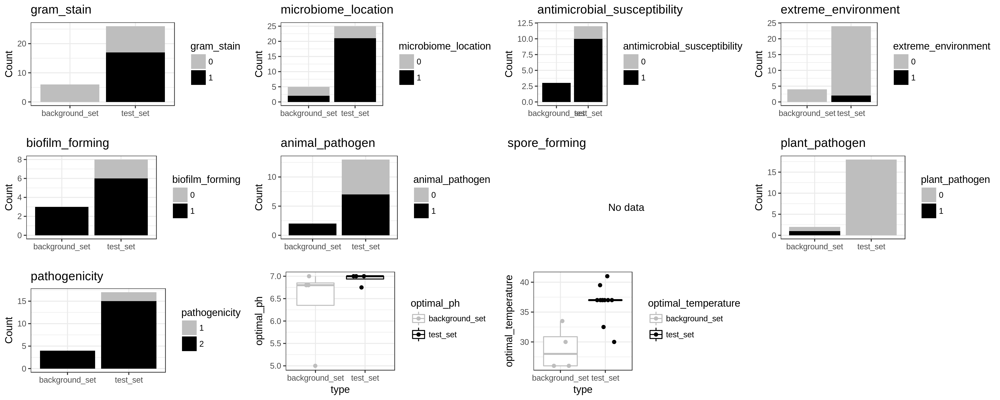

## Overview

It is often of interest to evaluate the characteristics of differentially abundant microbes in a system of interest. [The Microbe Directory](https://microbe.directory) is a valuable resource that contains multiple pieces of information regarding growth preferences, antimicrobial susceptibilty, gram staining etc. of a large collection of microbes. It is browsable at the level of individual species and the data are made available on [GitHub](https://github.com/microbe-directory/microbe-directory) for more systematic bioinformatics analyses. The package described here makes use of the data that are available on GitHub to perform enrichment analyses based on the characteristics present in The Microbe Directory.


## Enrichment analysis

The Microbe Directory contains both categorical (gram_stain, microbiome_location, antimicrobial_susceptibility, extreme_environment, biofilm_forming, animal_pathogen, spore_forming, plant_pathogen, pathogenicity) and quantitative (optimal_ph, optimal_temperature) characteristics and these are treated differently in terms of the statistics used to define enrichment. MDAT takes as input two R vectors:

* A list of bacterial species of interest e.g. those that are more abundant in a given setting (test_set_file)
* A list of bacterial species that represent the comparator e.g. those that do not change in the setting of interest (background_set_file)

These species lists are in the form shown below:

p__Firmicutes;c__Clostridia;o__Clostridiales;f__Ruminococcaceae;g__Ruminococcus;s__Ruminococcus_bromii
p__Bacteroidetes;c__Bacteroidia;o__Bacteroidales;f__Bacteroidaceae;g__Bacteroides;s__Bacteroides_uniformis
p__Bacteroidetes;c__Bacteroidia;o__Bacteroidales;f__Rikenellaceae;g__Alistipes;s__Alistipes_shahii
p__Firmicutes;c__Clostridia;o__Clostridiales;f__Ruminococcaceae;g__Subdoligranulum;s__Subdoligranulum_unclassified
p__Bacteroidetes;c__Bacteroidia;o__Bacteroidales;f__Bacteroidaceae;g__Bacteroides;s__Bacteroides_thetaiotaomicron
p__Bacteroidetes;c__Bacteroidia;o__Bacteroidales;f__Bacteroidaceae;g__Bacteroides;s__Bacteroides_fragilis
p__Bacteroidetes;c__Bacteroidia;o__Bacteroidales;f__Porphyromonadaceae;g__Parabacteroides;s__Parabacteroides_johnsonii
p__Bacteroidetes;c__Bacteroidia;o__Bacteroidales;f__Bacteroidaceae;g__Bacteroides;s__Bacteroides_finegoldii
p__Bacteroidetes;c__Bacteroidia;o__Bacteroidales;f__Bacteroidaceae;g__Bacteroides;s__Bacteroides_vulgatus
p__Bacteroidetes;c__Bacteroidia;o__Bacteroidales;f__Rikenellaceae;g__Alistipes;s__Alistipes_finegoldii
...

where each element in the list is a species that contains all of the taxonomic information up to phylum level for that species (this is to be compatible with The Microbe Directory taconomic information). Often taxonomic naming schemes vary between analyses done by a user and those that are present in The Microbe Directory database. The best way to deal with this is to laboriously go through and check that the names in the two lists that are given passed to the function are consistent with The Microbe Directory (output of metaphlan). MDAT can do a dirty guess and reconciliation of names (use guess_names=TRUE) by assuming that the names in the list and The Microbe Directory are the same up to family level and the species suffix (e.g. the coli of Escherchia coli) are the same and then reconciles any genus-level discrepancies (this is where we have seen a lot of the discrepancies). This is not completely ideal and may leave a number of species unannotated that are actually present in The Microbe Directory.

The steps of the analysis are straightforward - the test_set is compared to the background set in terms of annotation. For categorical variables this is done by building a 2 x n contingency table (n = the number of levels for the categorical variable) and statistical testing performed using a Fisher's exact test. For quantitative variables, the values for the test_set are compared to the values of the background set using a Wicoxon Rank Sum test. Plots are produced for visualising the results.


## Installation

The package can be installed using the devtools package.

```
    install.packages("devtools")
    devtools::install_github("nickilott/MDAT")
```

## Running MDAT

To perform enrichment analysis with MDAT simply provide the test_set and the background_set vectors:

```
    library(MDAT)
    results.mdat <- run_associations(test_set=test_set, background_set=background_set, guess_names=FALSE)
```

This will return a list where the first element is a dataframe with the results of the statistical analyses and the second is a grid of plots. To access each element you can type:

```
    get_results(results.mdat)
```

Which will print the results to the console:

|variable                     |test              | statistic|    pvalue|    qvalue|
|:----------------------------|:-----------------|---------:|---------:|---------:|
|gram_stain                   |Fisher            |       Inf| 0.0055231| 0.0439658|
|microbiome_location          |Fisher            |  7.149923| 0.0679340| 0.2264466|
|antimicrobial_susceptibility |Fisher            |  0.000000| 1.0000000| 1.0000000|
|extreme_environment          |Fisher            |       Inf| 1.0000000| 1.0000000|
|biofilm_forming              |Fisher            |  0.000000| 1.0000000| 1.0000000|
|animal_pathogen              |Fisher            |  0.000000| 0.4857143| 0.8095238|
|plant_pathogen               |Fisher            |  0.000000| 0.1000000| 0.2500000|
|pathogenicity                |Fisher            |  0.000000| 1.0000000| 1.0000000|
|optimal_ph                   |Wilcoxon rank sum | 11.500000| 0.3528967| 0.7057934|
|optimal_temperature          |Wilcoxon rank sum | 41.500000| 0.0087932| 0.0439658|


and:

```
    plot_results(results.mdat)
```

Which will display the results for each variable analysed (stacked bar for categorical variables and boxplots with jittered points for quantitative variables).




